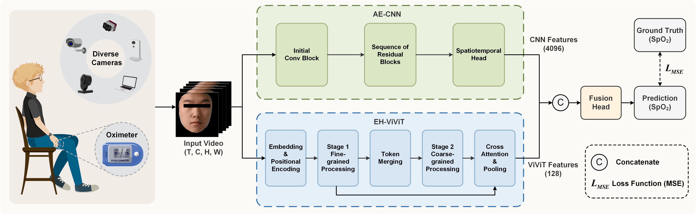

# PDH-Net

**Official PyTorch implementation of the paper: "PDH-Net: A Parallel Dual-branch Hybrid Network for Camera-based Blood Oxygen Saturation Measurement"**

## 📢 Status Update
The source code is currently undergoing internal review and cleaning. **It will be released here upon the acceptance and publication of the manuscript.** Please stay tuned!

In the meantime, if you have any urgent academic inquiries regarding core implementation details, please feel free to contact the authors.

---

## 🌟 Overview
Blood oxygen saturation (SpO2) is a critical parameter for evaluating cardiopulmonary function. We propose **PDH-Net**, a novel Parallel Dual-branch Hybrid Network designed for robust, non-contact SpO2 estimation directly from facial videos.

  
  
<em>Figure 1: The overall architecture of the proposed PDH-Net.</em>

Our architecture leverages the complementary strengths of two parallel branches:
1. **Attention-Enhanced CNN (AE-CNN):** Efficiently extracts fine-grained local spatio-temporal physiological features (e.g., subtle skin color variations) using 3D convolutions and CBAM modules.
2. **Enhanced Hierarchical ViViT (EH-ViViT):** Captures long-range dependencies and global contextual information across video frames using a novel hierarchical structure with multi-scale cross-attention fusion.
